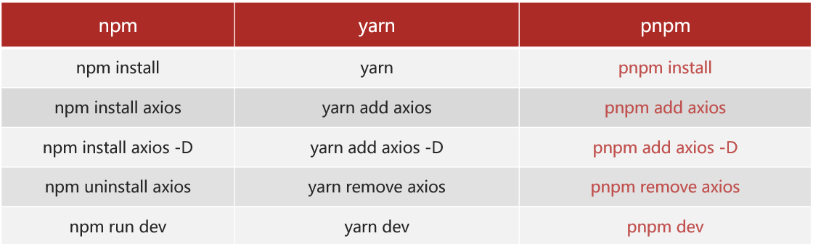
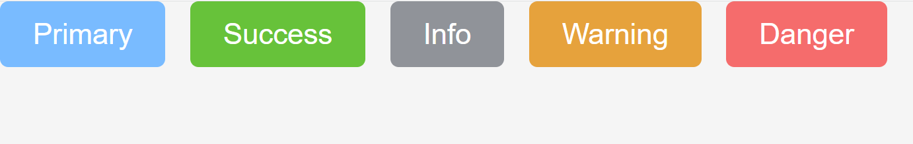

# 校园论坛 - 项目架构设计

本项目技术栈基于 [vue3](https://cn.vuejs.org/index.html)、[pinia](https://pinia.web3doc.top/)、[vue-router](https://router.vuejs.org/) 、vite  和 [element-plus](https://element-plus.org/)

## 项目页面截取: 


# 1. 创建项目和环境搭建

## **(1) pnpm 包管理器 **

一些优势：比同类工具快 2倍 左右、节省磁盘空间... https://www.pnpm.cn/

安装方式：

```
npm install -g pnpm@8
```

创建项目：

```
pnpm create vue
```




## (2)  ESLint & prettier 配置代码风格

1. 在左侧插件安装处安装插件 ESlint，即可开启保存自动修复
2. 在左侧插件安装处禁用件 Prettier，并在设置中的setting.json文件中打出以下代码以关闭保存自动格式化

```jsx
// ESlint插件 + Vscode配置 实现自动格式化修复
"editor.codeActionsOnSave": {
    "source.fixAll": "always"
},
"editor.formatOnSave": false,
```

3. 在.eslintrc.cjs中配置文件prettier

   prettier 风格配置 [https://prettier.io](https://prettier.io/docs/en/options.html )

   1. 单引号

   2. 不使用分号

   3. 每行宽度至多80字符

   4. 不加对象|数组最后逗号

   5. 换行符号不限制（win mac 不一致）

   ​             f. vue组件名称多单词组成（忽略index.vue）

   ​             g. props解构（关闭）


```jsx
  rules: {
    'prettier/prettier': [
      'warn',
      {
        singleQuote: true, // 单引号
        semi: false, // 无分号
        printWidth: 80, // 每行宽度至多80字符
        trailingComma: 'none', // 不加对象|数组最后逗号
        endOfLine: 'auto' // 换行符号不限制（win mac 不一致）
      }
    ],
    'vue/multi-word-component-names': [
      'warn',
      {
        ignores: ['index'] // vue组件名称多单词组成（忽略index.vue）
      }
    ],
    'vue/no-setup-props-destructure': ['off'], // 关闭 props 解构的校验
    // 💡 添加未定义变量错误提示，create-vue@3.6.3 关闭，这里加上是为了支持下一个章节演示。
    'no-undef': 'error'
  }
```


## (3) 基于 husky  的代码检查工作流

husky 是一个 git hooks 工具  ( git的钩子工具，可以在特定时机执行特定的命令 ), 以下是husky的配置过程: 

1. 先以管理员身份打开vscode, 然后进行git初始化, 命令为:  git init

2. 初始化 husky 工具配置  https://typicode.github.io/husky/

```jsx
pnpm dlx husky-init && pnpm install
```

3. 修改 .husky/pre-commit 文件

```jsx
pnpm lint
```

4. 保证package.json文件中关于lint的那一行是这样写的

```jsx
"lint": "eslint . --ext .vue,.js,.jsx,.cjs,.mjs --fix --ignore-path .gitignore",
```


为了解决husky的全量检查，耗时问题，历史问题, 以下是lint-staged的配置过程: 

1. 安装

```jsx
pnpm i lint-staged -D
```

2. 配置 `package.json`

```jsx
//在package.json的最大的括号里面加(加在最后面)
{
  // ... 省略 ...
  "lint-staged": {
    "*.{js,ts,vue}": [
      "eslint --fix"
    ]
  }
}
//在package.json中的"scripts"对应的那个括号里加
{
  "scripts": {
    // ... 省略 ...
    "lint-staged": "lint-staged"
  }
}
```

3. 修改 .husky/pre-commit 文件

```jsx
pnpm lint-staged
```


## (4) 调整项目目录

默认生成的目录结构不满足我们的开发需求，所以这里需要做一些自定义改动。主要是以下几个工作：

1. 删除初始化的默认文件

2. 修改内容

`src/router/index.js`

```jsx
import { createRouter, createWebHistory } from 'vue-router'

const router = createRouter({
  history: createWebHistory(import.meta.env.BASE_URL),
  routes: []
})

export default router
```

`src/App.vue`

```jsx
<script setup></script>

<template>
  <div>
    <router-view></router-view>
  </div>
</template>

<style scoped></style>
```

`src/main.js`

```jsx
import { createApp } from 'vue'
import { createPinia } from 'pinia'

import App from './App.vue'
import router from './router'

const app = createApp(App)

app.use(createPinia())
app.use(router)
app.mount('#app')
```

3. 新增需要目录 api  utils


4. 将项目需要的全局样式 和 图片文件，复制到 assets 文件夹中,  并将全局样式在main.js中引入

```jsx
import '@/assets/main.scss'
```

- 由于没有安装依赖在引入时会报错, 所以要安装 sass 依赖

```jsx
pnpm add sass -D
```


## (5) 引入 element-ui 组件库

官方文档： https://element-plus.org/zh-CN/

1. 安装

```jsx
$ pnpm add element-plus
```

2. 配置按需导入：

- 安装插件

```jsx
pnpm add -D unplugin-vue-components unplugin-auto-import
```

- 然后把下列代码插入到你的 `Vite` 或 `Webpack` 的配置文件中

```jsx
...
import AutoImport from 'unplugin-auto-import/vite'
import Components from 'unplugin-vue-components/vite'
import { ElementPlusResolver } from 'unplugin-vue-components/resolvers'

// https://vitejs.dev/config/
export default defineConfig({
  plugins: [
    ...
    AutoImport({
      resolvers: [ElementPlusResolver()]
    }),
    Components({
      resolvers: [ElementPlusResolver()]
    })
  ]
})

```

3. 直接使用

```jsx
<template>
  <div>
    <el-button type="primary">Primary</el-button>
    <el-button type="success">Success</el-button>
    <el-button type="info">Info</el-button>
    <el-button type="warning">Warning</el-button>
    <el-button type="danger">Danger</el-button>
    ...
  </div>
</template>
```




## (6) Pinia - 构建用户仓库 和 持久化

官方文档：https://prazdevs.github.io/pinia-plugin-persistedstate/zh/

1. 安装插件 pinia-plugin-persistedstate

```jsx
pnpm add pinia-plugin-persistedstate -D
```

2. 使用 main.js

```jsx
import persist from 'pinia-plugin-persistedstate'
...
app.use(createPinia().use(persist))
```

3. 配置 stores/user.js

```jsx
import { defineStore } from 'pinia'
import { ref } from 'vue'

// 用户模块
export const useUserStore = defineStore(
  'big-user',
  () => {
    const token = ref('') // 定义 token
    const setToken = (t) => (token.value = t) // 设置 token
    return { token, setToken }
  },
  {
    persist: true // 持久化
  }
)

```

4. 创建stores/index.js, 由 stores/index.js 统一导出仓库，导入路径统一 `./stores`，而且仓库维护在 stores/modules 中, stores/index.js中的代码如下: 

```jsx
import { createPinia } from 'pinia'
import persist from 'pinia-plugin-persistedstate'
const pinia = createPinia()
pinia.use(persist)
export default pinia
export * from './modules/counter'

```


## (7) 数据交互 - 请求工具设计

1. 安装 axios

```
pnpm add axios
```

2. 新建 `utils/request.js` 封装 axios 模块

   利用 axios.create 创建一个自定义的 axios (即创建axios实例)来使用

   http://www.axios-js.com/zh-cn/docs/#axios-create-config

```js
import axios from 'axios'

const baseURL = 'http://big-event-vue-api-t.itheima.net'

const instance = axios.create({
  // TODO 1. 基础地址，超时时间
})

instance.interceptors.request.use(
  (config) => {
    // TODO 2. 携带token
    return config
  },
  (err) => Promise.reject(err)
)

instance.interceptors.response.use(
  (res) => {
    // TODO 3. 处理业务失败
    // TODO 4. 摘取核心响应数据
    return res
  },
  (err) => {
    // TODO 5. 处理401错误
    return Promise.reject(err)
  }
)

export default instance
```

3. 完成 axios 基本配置

```jsx
import { useUserStore } from '@/stores/user'
import axios from 'axios'
import router from '@/router'
import { ElMessage } from 'element-plus'

const baseURL = 'http://big-event-vue-api-t.itheima.net'

const instance = axios.create({
  baseURL,
  timeout: 100000
})

instance.interceptors.request.use(
  (config) => {
     // 如果用户处于登录状态, 那么就需要在所有请求接口的请求头中加上token令牌
    const userStore = useUserStore()
    if (userStore.token) {
      config.headers.Authorization = userStore.token
    }
    return config
  },
  (err) => Promise.reject(err)
)

instance.interceptors.response.use(
  (res) => {
    // 如果response.status === 200, 并且response.data.code === 0, 那么就请求成功
    if (res.data.code === 0) {
      return res
    }
    // 如果response.status === 200, 但是response.data.code !== 0, 那么就请求失败, 但是由于是response.status === 200, 所以并不会触发 error 回调函数抛出错误, 因此这里需要手动抛出错误
    ElMessage({ message: res.data.message || '服务异常', type: 'error' })
   // 这里不用Promise.reject(response.data.message)是因为reject 返回的应该是一个可以描述错误的对象或信息，以便调用者能根据这个对象做出相应处理。
    return Promise.reject(res.data)
  },
  (err) => {
    ElMessage({ message: err.response.data.message || '服务异常', type: 'error' })
    if (err.response?.status === 401) {
      router.push('/login')
    }
    return Promise.reject(err)
  }
)

export default instance
export { baseURL }

```


## (8) 首页整体路由设计

​            1.约定路由规则(可以现在全部配完，也可以边写页面边配路由)

| path                   | 文件                              | 功能         | 组件名          | 路由级别 |
| ---------------------- | --------------------------------- | ------------ | --------------- | -------- |
| /login                 | views/login/LoginIn.vue           | 登录&注册    | LoginIn         | 一级路由 |
| /                      | views/layout/LayoutContainer.vue  | 布局架子     | LayoutContainer | 一级路由 |
| ├─ / 42458             | views/graduate/GraduateRegion.vue | 考研交流     | GraduateRegion  | 二级路由 |
| ├─ / 42602             | views/ job/JobRegion.vue          | 找工作交流   | JobRegion       | 二级路由 |
| ├─ / study             | views/study/StudyRegion.vue       | 日常学习问题 | StudyRegion     | 二级路由 |
| ├─ / 42397             | views/daychat/ChatRegion.vue      | 日常唠嗑     | ChatRegion      | 二级路由 |
| ├─ / profile           | views/profile/ProfileRegion.vue   | 个人中心     | ProfileRegion   | 二级路由 |
| ├─ / profile/myArticle | views/profile/MyarticleRegion.vue | 我的文章     | MyarticleRegion | 三级路由 |
| ├─ / profile/basicInfo | views/profile/BasicInfoRegion.vue | 基本资料     | BasicInfoRegion | 三级路由 |
|                        |                                   |              |                 |          |

2. 登录访问拦截,  要实现用户未授权(即未登录)的时候只能访问登录页，用户访问其他所有页面都需要先登录再访问的目标, 在src/router/index.js中写以下代码: 

```jsx
// 登录访问拦截
router.beforeEach((to) => {
  const userStore = useUserStore()
  if (!userStore.token && to.path !== '/login') return '/login'
})
```


# 2. 登录注册页面

## (1) 注册登录静态结构

1. 安装 element-plus 图标库

```jsx
pnpm i @element-plus/icons-vue
```

2. 静态结构准备

```jsx
<script setup>
import { ref } from 'vue'
import { User, Lock } from '@element-plus/icons-vue'
const isRegister = ref(false)
const formModel = ref({
  username: '',
  password: '',
  repassword: ''
})
const rules = {
  username: [
    { required: true, message: '请输入用户名', trigger: 'blur' },
    {
      pattern: /^[0-9a-zA-Z]{1,10}$/,
      message: '用户名必须是1-10位的字母数字',
      trigger: 'blur'
    }
  ],
  password: [
    { required: true, message: '请输入密码', trigger: 'blur' },
    {
      pattern: /^\S{6,15}$/,
      message: '密码必须是6-15位的非空字符',
      trigger: 'blur'
    }
  ],
  repassword: [
    { required: true, message: '请再次输入密码', trigger: 'blur' },
    {
      pattern: /^\S{6,15}$/,
      message: '密码必须是6-15位的非空字符',
      trigger: 'blur'
    },
    {
      validator: (rule, value, callback) => {
        if (value !== formModel.value.password) {
          callback(new Error('两次密码不一致'))
        } else {
          callback()
        }
      },
      trigger: 'blur'
    }
  ]
}
</script>
<template>
  <div class="container">
    <div class="banner">校园信息论坛</div>
    <div class="main">
      <div class="phone">
        <el-form
          :model="formModel"
          :rules="rules"
          ref="formRef"
          autocomplete="off"
          size="large"
          v-if="isRegister"
        >
          <el-form-item>
            <h1>注册</h1>
          </el-form-item>
          <el-form-item prop="username">
            <el-input
              v-model="formModel.username"
              :prefix-icon="User"
              placeholder="请输入用户名"
            ></el-input>
          </el-form-item>
          <el-form-item prop="password">
            <el-input
              v-model="formModel.password"
              :prefix-icon="Lock"
              type="password"
              placeholder="请输入密码"
            ></el-input>
          </el-form-item>
          <el-form-item prop="repassword">
            <el-input
              v-model="formModel.repassword"
              :prefix-icon="Lock"
              type="password"
              placeholder="请输入再次密码"
            ></el-input>
          </el-form-item>
          <el-form-item>
            <el-button class="button" type="primary" auto-insert-space>
              注册
            </el-button>
          </el-form-item>
          <el-form-item class="flex">
            <el-link type="info" :underline="false" @click="isRegister = false">
              ← 返回
            </el-link>
          </el-form-item>
        </el-form>
        <el-form
          :model="formModel"
          :rules="rules"
          ref="formRef"
          size="large"
          autocomplete="off"
          v-else
        >
          <el-form-item>
            <h1>登录</h1>
          </el-form-item>
          <el-form-item prop="username">
            <el-input
              v-model="formModel.username"
              :prefix-icon="User"
              placeholder="请输入用户名"
            ></el-input>
          </el-form-item>
          <el-form-item prop="password">
            <el-input
              v-model="formModel.password"
              :prefix-icon="Lock"
              type="password"
              placeholder="请输入密码"
            ></el-input>
          </el-form-item>
          <el-form-item class="flex">
            <div class="flex">
              <el-checkbox>记住我</el-checkbox>
              <el-link type="primary" :underline="false">忘记密码？</el-link>
            </div>
          </el-form-item>
          <el-form-item>
            <el-button class="button" type="primary" auto-insert-space
              >登录</el-button
            >
          </el-form-item>
          <el-form-item class="flex">
            <a href="http://38617112yi.zicp.vip/oauth/login">
              
            </a>
            <a href="https://im.qq.com/index/">
              
            </a>
            <el-link
              type="info"
              :underline="false"
              @click="isRegister = true"
              style="margin-left: 300px"
            >
              注册 →
            </el-link>
          </el-form-item>
        </el-form>
      </div>
    </div>
  </div>
</template>
<style lang="scss" scoped>
img {
  width: 40px;
  height: 40px;
  margin-left: 20px;
}
.container {
  width: 1000px;
  height: 700px;
  border-radius: 10px;
  //background: #fff;
  margin: 0 auto;
  box-shadow: 0 15px 20px rgba(0, 0, 0, 0.11);
  .banner {
    padding-left: 10px;
    box-sizing: border-box;
    width: 1000px;
    height: 100px;
    background: #409eff;
    line-height: 100px;
    font-size: 20px;
    color: #fff;
  }
  .main {
    width: 1000px;
    height: 600px;
    .phone {
      width: 50%;
      margin: 10px auto;
      .button {
        width: 100%;
      }
      .flex {
        width: 100%;
        display: flex;
        justify-content: space-between;
      }
    }
  }
}
</style>

```


## (2) 实现注册功能

1. 通过 ref 获取到表单组件

```jsx
const form = ref()

<el-form ref="form">
```

2. 注册之前进行校验

```jsx
<el-button
  @click="register"
  class="button"
  type="primary"
  auto-insert-space
>
  注册
</el-button>

const register = async () => {
  await form.value.validate()
  console.log('开始注册请求')

```

3. 新建 api/user.js 封装

```jsx
import request from '@/utils/request'

export const userRegisterService = ({ username, password, repassword }) =>
  request.post('/api/reg', { username, password, repassword })
```

4. 页面中调用

```jsx
const register = async () => {
  await form.value.validate()
  await userRegisterService(formModel.value)
  ElMessage.success('注册成功')
  // 切换到登录
  isRegister.value = false
}
```

5. eslintrc 中声明全局变量名,  解决 ElMessage 报错问题

```jsx
module.exports = {
  ...
  globals: {
    ElMessage: 'readonly',
    ElMessageBox: 'readonly',
    ElLoading: 'readonly'
  }
}
```


## (3) 实现登录功能

1.  注册事件，进行登录前的预校验 (获取到组件调用方法)

```jsx
<el-form ref="form">
    
const login = async () => {
  await form.value.validate()
  console.log('开始登录')
}
```

2. 封装接口 API

```jsx
export const userLoginService = ({ username, password }) =>
  request.post('api/login', { username, password })
```

3. 调用方法将 token 存入 pinia 并自动持久化本地

```jsx
const userStore = useUserStore()
const router = useRouter()
const login = async () => {
  await form.value.validate()
  const res = await userLoginService(formModel.value)
  userStore.setToken(res.data.token)
  ElMessage.success('登录成功')
  router.push('/')
}
```


# 3. 首页 layout 架子 

## (1) 首页架子静态结构

```jsx
<template>
  <div id="banner">
    <el-row>
      <el-col :span="7">
        <div class="logo">
          
          <p>社区</p>
        </div>
      </el-col>
      <el-col :span="6" class="search-container">
        <el-icon><Search /></el-icon>
        <input
          v-model="inputSearch"
          placeholder="请输入关键词"
          class="search-input"
        />
        <span class="divider"></span>
        <el-button class="search-button" @click="onEnterSearch()"
          >搜索</el-button
        >
      </el-col>
      <el-col :span="11">
        <div class="right">
          <div class="btn">
            <el-dropdown placement="bottom-end" @command="handleCommand">
              <span class="el-dropdown__box">
                <el-avatar :src="userStore.user.user_pic || avatar" />
                <el-icon><CaretBottom /></el-icon>
              </span>
              <template #dropdown>
                <el-dropdown-menu>
                  <el-dropdown-item command="goWrite" :icon="Edit"
                    >发布文章</el-dropdown-item
                  >
                  <el-dropdown-item command="check" :icon="School"
                    >切换学校</el-dropdown-item
                  >
                  <el-dropdown-item command="profile" :icon="User"
                    >个人中心</el-dropdown-item
                  >
                  <el-dropdown-item command="logout" :icon="SwitchButton"
                    >退出登录</el-dropdown-item
                  >
                </el-dropdown-menu>
              </template>
            </el-dropdown>
          </div>
        </div>
      </el-col>
    </el-row>
  </div>
  <el-container class="layout-container">
    <el-aside width="200px">
      <el-menu
        active-text-color="#ff8c00"
        :default-active="$route.path"
        text-color="#333"
        router
      >
        <div class="content-title">
          <el-icon><ChatDotSquare /></el-icon><span>讨论区</span>
        </div>
        <el-menu-item index="/42458">
          <el-icon><Sunny /></el-icon>
          <span>考研交流</span>
        </el-menu-item>
        <el-menu-item index="/42602">
          <el-icon><Sunny /></el-icon>
          <span>找工作交流</span>
        </el-menu-item>
        <el-menu-item index="/study">
          <el-icon><Sunny /></el-icon>
          <span>日常学习问题</span>
        </el-menu-item>
        <el-menu-item index="">
          <el-icon><Sunny /></el-icon>
          <span>寻物启事</span>
        </el-menu-item>
        <el-menu-item index="">
          <el-icon><Sunny /></el-icon>
          <span>闲置出售</span>
        </el-menu-item>
        <el-menu-item index="">
          <el-icon><Sunny /></el-icon>
          <span>拼单拼车</span>
        </el-menu-item>
        <el-menu-item index="">
          <el-icon><Sunny /></el-icon>
          <span>表白墙</span>
        </el-menu-item>
        <el-menu-item index="/42397">
          <el-icon><Sunny /></el-icon>
          <span>日常唠嗑</span>
        </el-menu-item>
        <el-menu-item index="">
          <el-icon><Sunny /></el-icon>
          <span>树洞倾诉</span>
        </el-menu-item>
        <el-menu-item index="">
          <el-icon><Sunny /></el-icon>
          <span>竞赛组队</span>
        </el-menu-item>
      </el-menu>
    </el-aside>
    <el-main><router-view></router-view></el-main>
  </el-container>
</template>
<style lang="scss" scoped>
#banner {
  height: 80px;
  background: #fff;
  box-shadow: 0 2px 7px rgba(0, 0, 0, 0.11);
  //最左边的logo和字
  .logo {
    height: 60px;
    display: flex;
    margin-right: 100px;
    margin-top: 10px;
    img {
      width: 50px;
      height: 50px;
      margin: 10px 10px 0 10px;
    }
    p {
      font-size: 22px;
      margin-top: 22px;
      color: rgb(63, 61, 61);
    }
  }
  //搜索框
  .search-container {
    display: flex;
    align-items: center;
    width: 320px;
    margin-top: 25px;
    padding: 5px;
    background-color: #f0f0f0;
    border-radius: 20px;
    .el-icon {
      color: #939393;
      margin: 0 5px 0;
    }
    .search-input::placeholder {
      color: #939393;
    }
    .search-input {
      flex: 1;
      border: none;
      outline: none;
      background-color: transparent;
      font-size: 14px;
      color: #333;
    }
    .divider {
      width: 1px;
      height: 20px;
      background-color: #dcdcdc;
    }
    .search-button {
      background: none;
      border: none;
      color: #ff8c00;
      font-size: 14px;
      cursor: pointer;
    }
  }
  //切换学校和写文章按钮
  .right {
    display: flex;
    .btn {
      margin-left: 200px;
      //头像下拉框部分
      .el-dropdown__box {
        display: flex;
        align-items: center;
        margin-top: 25px;
        margin-left: 400px;
        .el-icon {
          color: #999;
          margin-left: 10px;
        }
        &:active,
        &:focus {
          outline: none;
        }
      }
    }
  }
}
.layout-container {
  margin-top: 20px;
  height: 698px;
  box-sizing: border-box;
  // background-color: pink;
  .el-aside {
    .el-menu {
      border-right: none;
      .el-menu-item:hover {
        background-color: #f9f9f9;
      }
      .content-title {
        display: flex;
        align-items: center;
        margin: 20px 0 15px 20px;
        color: #9e9e9e; /* 灰色字体 */
        cursor: default; /* 鼠标变成默认状态 */
        font-size: 18px;
        span {
          margin-left: 5px;
        }
      }
      .el-menu-item {
        font-size: 15px;
      }
    }
  }
}
</style>
```


## (2) 实现页面渲染

1. `api/user.js`封装接口

```jsx
export const userGetInfoService = () => request.get('/my/userinfo')
```

2. stores/modules/user.js 定义数据

```jsx
const user = ref({})
const getUser = async () => {
  const res = await userGetInfoService() // 请求获取数据
  user.value = res.data.data
}
```

3. `layout/LayoutContainer`页面中调用

```js
import { useUserStore } from '@/stores'
const userStore = useUserStore()
onMounted(() => {
  userStore.getUser()
})
```

4. 动态渲染

```jsx
<el-avatar :src="userStore.user.user_pic || avatar" />
```


## (3)实现退出功能 

1. 注册点击事件

```jsx
<el-dropdown placement="bottom-end" @command="handleCommand">

<el-dropdown-menu>
   <el-dropdown-item command="" :icon="Edit">发布文章</el-dropdown-item>
   <el-dropdown-item command="check" :icon="School">切换学校</el-dropdown-item>
   <el-dropdown-item command="profile" :icon="User">个人中心</el-dropdown-item>
   <el-dropdown-item command="logout" :icon="SwitchButton">退出登录</el-dropdown-item>
</el-dropdown-menu>
```

2. 添加退出功能

```jsx
const handleCommand = async command => {
  if (command === 'logout') {
    await ElMessageBox.confirm('你确定要退出登录吗?', '温馨提示', {
      confirmButtonText: '确认',
      cancelButtonText: '取消',
      type: 'warning'
    })
    userStore.removeToken()
    userStore.removeUser()
    router.push('/login')
  } else {
    router.push(`/${command}`)
  }
}
```

3. stores/modules/user.js 提供 removeUser方法

```jsx
const removeUser = () => {
      user.value = {}
 }
```


# 4. 日常唠嗑页面

## (1) 日常唠嗑静态结构

1. @/views/daychat/ChatRegion.vue中的代码

```jsx
<script setup>
import LittleMessage from '@/components/LittleMessage.vue'
</script>
<template><LittleMessage :articleId="42397"></LittleMessage></template>
<style lang="scss" scoped></style>
```

2. @/components/LittleMessage.vue中的代码

```jsx
<script setup>
  ~~~~~~~~~~~~~~~~~~~~~~<!-- 这里待写实现文章列表的渲染的代码 -->~~~~~~~~~~~~~~~~~~~~~~~~~~~~~~~~
  ~~~~~~~~~~~~~~~~~~~~~~<!-- 这里待写实现分页渲染逻辑的代码 -->~~~~~~~~~~~~~~~~~~~~~~~~~~~~~~~~~~
const share = () => {
  console.log('分享')
}
const clickComment = () => {
  console.log('评论')
}
const setZan = () => {
  console.log('点赞赞')
}
</script>
<template>
  <el-row>
    <el-col :span="17" v-loading="loading">
      <div v-for="item in arr" :key="item.id" class="content-box">
        <!-- 头像，用户名 -->
        <div class="content-box-top">
          <el-avatar
            class="content-box-avatar"
            shape="circle"
            :size="50"
            :src="userStore.user.user_pic || avatar"
          ></el-avatar>
          <div class="nickcatetime">
            <div class="nickName">{{ userStore.user.nickname }}</div>
            <div class="content-catetime">
              <div class="content-category-tag">{{ item.cate_name }}</div>
              <span class="content-box-time">
                {{ Getdayjs(item.pub_date) }}
              </span>
            </div>
          </div>
        </div>
        <!-- 内容 -->
        <div class="content-feed-content">
          <!-- 文字部分 -->
          <div class="content-feed-ogText">{{ item.content }}</div>
          <!-- 图片/视频部分 -->
          <div v-if="item.img" class="content-feed-ogImage">
            <a href="#"></a>
          </div>
          <!-- 底部一键三连部分 -->
          <div>
            <div class="content-bootom-svg">
              <!-- 分享链接 -->
              <div class="content-bottom-hover" @click="share()">
                
                <span>10</span>
              </div>
              <!-- 评论 -->
              <div class="content-bottom-hover" @click="clickComment()">
                
                <span>20</span>
              </div>
              <!-- 赞 -->
              <div class="content-bottom-hover" @click="setZan()">
                
                <span>5</span>
              </div>
            </div>
            <!-- 评论列表 -->
            <div v-if="showComment">
              <!-- <Comment :contentObj="contentObj"></Comment> -->
            </div>
          </div>
        </div>
      </div>
   ~~~~~~~~~~~~~~~~~~~~~~~~~~~<!-- 这里待写分页组件的代码 -->~~~~~~~~~~~~~~~~~~~~~~~~~~~~~~~~~~~
    </el-col>
    <el-col :span="6"><HotSearch></HotSearch></el-col>
  </el-row>
</template>
<style lang="scss" scoped>
.content-box {
  width: 780px;
  margin: 0 0 20px 0;
  padding: 20px 20px 0;
  background-color: #fff;
  box-shadow: 0px 0px 25px rgb(0 0 0 / 10%);
  border: 1px solid rgba(255, 255, 255, 0.5);
  border-right: 1px solid rgba(255, 255, 255, 0.2);
  border-bottom: 1px solid rgba(255, 255, 255, 0.2);
  border-radius: 10px;
}
.content-box-top {
  display: flex;
  height: 50px;
}
.content-box-avatar {
  margin-right: 10px;
}
.nickcatetime {
  margin-top: 3px;
}
.nickName {
  font-weight: bolder;
  font-size: 15px;
  margin-bottom: 5px;
}
.content-catetime {
  display: flex;
  align-items: center;
}
.content-category-tag {
  margin-right: 4px;
  font-size: 12px;
  color: #939393;
  display: inline-block;
  min-width: 26px;
  border: 1px solid #ccc;
  border-radius: 2px;
  height: 12px;
  line-height: 12px;
  text-align: center;
  padding: 1px;
}
.content-box-time {
  font-size: 12px;
  color: darkgrey;
}
.content-feed-content {
  padding-left: 60px;
  margin: 0px 10px 0 0;
}
.content-feed-ogText {
  white-space: pre-wrap;
  color: #333;
  font-size: 16px;
  line-height: 24px;
}
.content-feed-ogImage {
  margin-top: 8px;
}
// 一键三连部分
.content-bootom-svg {
  display: flex;
  justify-content: space-between;
  font-weight: bolder;
  color: rgb(110, 110, 110);
  margin: 10px 15px 15px 0px;
}
.content-bottom-hover {
  display: flex;
  align-items: center;
  font-size: 12px;
  cursor: pointer;
  color: rgb(110, 110, 110);
  img {
    width: 20px;
    height: 20px;
  }
  span {
    margin-left: 5px;
  }
}
// .content-bottom-hover:hover {
//   color: #409eff;
// }
</style>
```

3. @/components/HotSearch.vue中的代码

```js
<script setup>
import { ref } from 'vue'
const hotItems = ref([
  {
    rank: 1,
    title: '当了一学期的大爷,当几天孙子又何妨',
    heat: '234万',
    heatIcon: true
  },
  { rank: 2, title: '到我这个年纪你们就都懂了', heat: '198万' },
  { rank: 3, title: '悬溺一响纯爱登场', heat: '150万' },
  { rank: 4, title: '这个世界到底谁在幸福', heat: '102万' },
  { rank: 5, title: '你的眼泪和屋檐上的脏水没有区别', heat: '85万' },
  { rank: 6, title: '随便一套,笑死全校', heat: '70万' },
  { rank: 7, title: '想你的一便又一便', heat: '65万' },
  { rank: 8, title: '已驾崩勿扰', heat: '56万' },
  { rank: 9, title: '死丫头把你腿毛燎了', heat: '44万' },
  { rank: 10, title: '谈赛博恋爱逗电子蛐蛐', heat: '25万' }
])
const morehot = () => {
  console.log('查看更多热度榜')
}
</script>
<template>
  <el-menu class="hot-list-container" :default-active="$route.path" router>
    <div class="hot-list-title">热度榜</div>
    <el-menu-item
      index="/login"
      v-for="item in hotItems"
      :key="item.rank"
      class="hot-item"
    >
      <span class="rank">{{ item.rank }}</span>
      <span :class="['title', item.heatIcon && 'heat-icon']">{{
        item.title
      }}</span>
      <span class="heat">{{ item.heat }}</span>
    </el-menu-item>
    <a href="#" class="more-link" @click="morehot()">查看更多热度榜</a>
  </el-menu>
</template>
<style lang="scss" scoped>
.hot-list-container {
  position: fixed;
  top: 120px; /* 你可以调整这个值来控制离页面顶部的距离 */
  right: 73px; /* 你可以调整这个值来控制离页面右侧的距离 */
  z-index: 1000; /* 确保它在其他内容之上 */
  width: 320px;
  background-color: #fff;
  border-radius: 10px;
  box-shadow: 0px 4px 10px rgba(0, 0, 0, 0.1);
  overflow: hidden;
}
.hot-list-title {
  padding: 15px;
  font-weight: bold;
  color: #333;
  font-size: 18px;
  border-bottom: 1px solid #eaeaea;
}
.hot-item {
  height: 44px;
  display: flex;
  justify-content: space-between;
  padding: 0 15px;
  align-items: center;
  transition: background-color 0.3s;
  cursor: pointer;
}
.hot-item:hover {
  background-color: #f9f9f9;
}
.hot-item .rank {
  font-weight: bold;
  font-size: 16px;
  color: #ff5a5f;
  margin-right: 10px;
}
.hot-item .title {
  flex-grow: 1;
  font-size: 14px;
  color: #333;
}
.hot-item .title.heat-icon {
  color: #ff5a5f;
}
.hot-item .heat {
  font-size: 14px;
  color: #999;
}
.more-link {
  display: block;
  text-align: center;
  padding: 10px 0;
  color: #ff5a5f;
  text-decoration: none;
  font-size: 14px;
  border-top: 1px solid #eaeaea;
}
.more-link:hover {
  background-color: #f9f9f9;
}
</style>

```


## (2)实现文章列表的渲染

实现文章列表的渲染的代码如下:

  (注:  1. 这部分代码和实现分页功能的代码在@/components/LittleMessage.vue中写。 

2. 这部分要想知道具体哪些分类板块有写文章, 需要登录大事件的账号: fwdx666 12345678 查看。)

```jsx
<script setup>
import { ref, onMounted } from 'vue'
import avatar from '@/assets/default.png'
import fenxiang from '@/assets/fenxiang.png'
import comment from '@/assets/pinlun.png'
import dz from '@/assets/dz.png'
import HotSearch from './HotSearch.vue'
import { articleListService, articleDetailsService } from '@/api/article'
import { baseURL } from '@/utils/request'
import { useUserStore } from '@/stores'
import { Getdayjs } from '@/utils/format'
const showComment = ref(false)
const userStore = useUserStore()
const props = defineProps({
  articleId: {
    type: Number
  }
})
const arr = ref([])
const loading = ref(false)
const paging = ref({
  pagenum: 1,
  pagesize: 4,
  total: 0
})
const applyPage = async () => {
  loading.value = true
  const re = await articleListService({
    pagenum: paging.value.pagenum,
    pagesize: paging.value.pagesize,
    cate_id: props.articleId
  })
  arr.value = re.data.data
  paging.value.total = re.data.total
  loading.value = false
  arr.value.forEach(async item => {
    const re = await articleDetailsService(item.id)
    //将html格式的文本内容转换成纯文本内容
    const tempElement = document.createElement('div')
    tempElement.innerHTML = re.data.data.content
    let formattedContent = tempElement.innerHTML
      .replace(/<p>/g, '\n') // 替换 <p> 为换行符
      .replace(/<\/p>/g, '') // 移除 </p>
      .replace(/<br>/g, '\n') // 替换 <br> 为换行符
      .replace(/&nbsp;/g, ' ') // 将 &nbsp; 替换为普通空格
    item.content = formattedContent.trim()
    if (item.title === '图图') {
      item.img = baseURL + re.data.data.cover_img
    }
  })
}
onMounted(() => {
  applyPage()
})
</script>

```


## (3)实现分页功能

1. 分页组件代码

```jsx
 <div class="example-pagination-block">
    当翻到最后一页时，如果该页没有数据，el-pagination 会自动调整 current-page 为前一页，避免显示空页面。
        <el-pagination
          layout="prev, pager, next"
          :total="paging.total"
          :page-size="paging.pagesize"
          :current-page="paging.pagenum"
          @current-change="handlePageChange"
          style="margin-left: 300px"
        />
 </div>

```

1. 分页渲染逻辑的代码

```jsx
const handlePageChange = newpage => {
  paging.value.pagenum = newpage
  applyPage()
}
```


# 5. 文章发布, 编辑, 删除功能

## (1) 实现发布文章功能

1. 点击文章发布按钮会调用的函数

```jsx
template部分代码: 
<el-dropdown-item command="" :icon="Edit">发布文章</el-dropdown-item>

script部分代码: 
else if (command === '') {
    AddEditArticleRef.value.openAddEdit({})
  }
```

2. @/components/AddEditArticle.vue中的静态代码:

```jsx
<script setup>
const openAddEdit = isAddEdit => {
  dialogVisible.value = true
    if (isAddEdit.id) {
    //是编辑文章, 进行表单回显
    } else {
    //是发布文章, 进行表单重置
    }
}
defineExpose({
  openAddEdit
})
</script>
<template>
  <el-dialog
    class="el-dialog-ref"
    v-model="dialogVisible"
   // :title="formModel.id ? '快捷编辑' : '快捷发布'"
    width="500"
    style="border-radius: 10px"
  >
    <!-- 这里是写内容部分的地方 -->
    <el-form
      :model="formModel"
      :rules="rules"
   // ref="formRef"
      label-width="100px"
    >
      <el-form-item label="文章标题" prop="title"
        ><el-input v-model="formModel.title" placeholder="请输入标题"></el-input
      ></el-form-item>
      <el-form-item label="文章分类" prop="cate_id"
        ><channel-select v-model="formModel.cate_id"></channel-select
      ></el-form-item>
      <el-form-item label="文章封面" prop="cover_img">
        <div>图片文件上传部分</div>
      </el-form-item>
      <el-form-item label="文章内容" prop="content">
        <div>富文本编辑器部分</div>
      </el-form-item>
    </el-form>
    <!-- 这里是添加文章弹框尾部, 看是否要发布文章 -->
    <template #footer>
      <div class="dialog-footer">
        <el-button
          type="primary"
          style="border-radius: 20px"
        //@click="submitAddEdit"
        >
          发送
        </el-button>
      </div>
    </template>
  </el-dialog>
</template>
<style lang="scss" scoped>
// .el-dialog-ref {
// 这里试图修改el-dialog__title的样式, 但是没有成功捏/-\, 想想看有没有别的方法
//   :deep() {
//     .el-dialog__title {
//       color: red;
//     }
//   }
// }
</style>

```

3. @/components/ChannelSelect.vue中的代码: (这一步通过父传子和子传父实现formModel.cate_id与ChannelSelect组件的双向绑定)

```jsx
<script setup>
import { artArticleClassifyService } from '@/api/article'
import { ref } from 'vue'
const ChannelList = ref([])
const emit = defineEmits(['update:cateId'])
defineProps({
  cateId: {
    type: String
  }
})
const getChannelList = async () => {
  const re = await artArticleClassifyService()
  ChannelList.value = re.data.data
}
getChannelList()
</script>
<template>
  <el-select
    :modelValue="cateId"
    @update:modelValue="emit('update:cateId', $event)"
    ><el-option
      v-for="item in ChannelList"
      :key="item.id"
      :value="item.id"
      :label="item.cate_name"
    ></el-option
  ></el-select>
</template>

```

4. 中英国际化处理(在element-plus组件库中搜索zh-cn就可以搜到),  默认是英文的，由于这里不涉及切换， 所以在 App.vue 中直接导入设置成中文即可

```jsx
<script setup>
import zh from 'element-plus/es/locale/lang/zh-cn.mjs'
</script>

<template>
  <!-- 国际化处理 -->
  <el-config-provider :locale="zh">
    <router-view />
  </el-config-provider>
</template>
```

5. 一打开"发布文章"弹框,  需要重置添加的 form 表单数据

```jsx
const defaultModel = ref({
  title: '',
  cate_id: '',
  cover_img: '',
  content: '',
  state: '已发布'
})
//在定义formModel的时候千万不要写成const formModel = ref({ ...defaultModel }), 不然会报错
const formModel = ref({})

const openAddEdit = isAddEdit => {
  dialogVisible.value = true
    if (isAddEdit.id) {
    //是编辑文章, 进行表单回显
    console.log('编辑回显')
    } else {
    //是发布文章, 进行表单重置
    console.log('表单重置')
    //这一步一定要带上defaultModel的value, 不要写成formModel.value = { ...defaultModel }, 这样写也会报错
    formModel.value = { ...defaultModel.value }
    }
}
```

6. **图片文件上传部分**

   6.1 准备图片文件上传部分的结构

```jsx
import { Plus } from '@element-plus/icons-vue'

<el-upload
  class="avatar-uploader"
  :auto-upload="false"
  :show-file-list="false"
  :on-change="handleImageChange"
>
  
  <el-icon v-else class="avatar-uploader-icon"><Plus /></el-icon>
</el-upload>
```

​               6.2 选择图片的处理逻辑

```jsx
const imgUrl = ref('')
const handleImageChange = (uploadFile) => {
  imgUrl.value = URL.createObjectURL(uploadFile.raw)
  formModel.value.cover_img = uploadFile.raw
}
```

​              6.3 样式美化

```css
.avatar-uploader {
  :deep() {
    .avatar {
      width: 178px;
      height: 178px;
      display: block;
    }
    .el-upload {
      border: 1px dashed var(--el-border-color);
      border-radius: 6px;
      cursor: pointer;
      position: relative;
      overflow: hidden;
      transition: var(--el-transition-duration-fast);
    }
    .el-upload:hover {
      border-color: var(--el-color-primary);
    }
    .el-icon.avatar-uploader-icon {
      font-size: 28px;
      color: #8c939d;
      width: 178px;
      height: 178px;
      text-align: center;
    }
  }
}
```

7. **富文本编辑器部分 **(官网地址：https://vueup.github)

   7.1 安装包

```js
pnpm add @vueup/vue-quill@latest
```

​               7.2 在AddEditArticle.vue中注册成局部组件

```jsx
import { QuillEditor } from '@vueup/vue-quill'
import '@vueup/vue-quill/dist/vue-quill.snow.css'
```

​                7.3 向外暴露该组件

```jsx
defineExpose({
  openAddEdit,
  component: {
    QuillEditor
  }
})
```

​               7.4 页面中使用绑定

```jsx
<!-- 关于富文本编辑器: 
       1. 富文本编辑器中的文本框内容在与变量绑定时, 文本框内容改变的时候, 与之绑定的变量也会改变, 并且变量的值为string形式的html内容
       2. 富文本编辑器并不是完全响应式的, 当再次打开抽屉组件需要将抽屉组件中的内容全部清空时, 对于其他的地方只需清空与之绑定的变量即可, 但是对于富文本编辑器需要手动清空才可以, 用  quillRef.value.setHTML('')来实现富文本编辑器的清空效果。当然也有能够响应式的时候, 就是当与之绑定的变量的值的改变值不为空的时候, 富文本编辑器会自动响应式更新
       3. 如果要在script中对富文本编辑器的文本框进行赋值的话, 且赋的值是string形式的html内容, 需要在富文本编辑器中增加contentType="html", 让其知道需要解析的内容不是单纯文本框, 而是html标签 -->
<div class="editor">
  <quill-editor
    theme="snow"
    v-model:content="formModel.content"
    contentType="html"
  >
  </quill-editor>
</div>
```

​              7.5 样式美化

```jsx
.editor {
  width: 100%;
  :deep(.ql-editor) {
    min-height: 200px;
  }
}
```

8. 表单校验部分

```jsx
template部分代码:
<QuillEditor @blur="QuillEditorValidate()"></QuillEditor>

script部分代码:
const rules = {
  title: [
    { required: true, message: '请输入文章标题', trigger: 'blur' },
    { min: 1, max: 15, message: '标题长度在1-15个字符哦', trigger: 'blur' }
  ],
  //对于文章分类部分的校验, 'blur'事件是为了在点击提交按钮之后整体进行表单校验的时候触发, 然后'change'事件是为了用户在选择文章分类的时候触发, 并且这里change做了自定义校验, 是为了防止在用户打开发布文章的弹框的时候, 由于文章分类的值被重置, 导致触发了change事件, 造成表单的文章分类部分报错
  cate_id: [
    { required: true, message: '请选择文章分类', trigger: 'blur' },
    {
      validator: (rule, value, callback) => {
        if (
          value === '' &&
          (formModel.value.cover_img !== '' ||
            formModel.value.title !== '' ||
            formModel.value.content !== '')
        ) {
          callback(new Error('请选择文章分类'))
        } else {
          callback()
        }
      },
      trigger: 'change'
    }
  ],
  //文章封面这部分虽然和文章分类部分一样使用了change事件, 但是由于文章封面没有使用v-model进行双向绑定, 所以就没有那么多弯弯绕绕, 不用像文章分类部分部分一样写那么多验证的东西, 就一个change事件就可以了
  cover_img: [{ required: true, message: '请上传文章封面', trigger: 'change' }],
  content: [{ required: true, message: '请输入文章内容', trigger: 'blur' }]
}

const handleImageChange = async file => {
    await formRef.value.validateField('cover_img')
}
const QuillEditorValidate = async () => {
  await formRef.value.validateField('content')
}
```

9. **当点击发布按钮时进行文章的发布**

   9.1 封装添加接口

```jsx
export const artArticlePublishService = obj =>
  request.post('/my/article/add', obj)
```

​                9.2 注册点击事件并进行调用

```jsx
<el-button @click="submitAddEdit">
发送
</el-button>

// 发布文章
const emit = defineEmits(['addEditSuccess'])
const submitAddEdit = async () => {
  await formRef.value.validate()
  //无论是发布文章还是编辑文章都需要做的操作
  const formData = new FormData()
  for (let key in formModel.value) {
    formData.append(key, formModel.value[key])
  }
  //若为编辑文章, 则调编辑文章相关接口
  if (formModel.value.id) {
    console.log('编辑操作')
  }
  //若为发布文章, 则调发布文章相关接口
  else {
    await artArticlePublishService(formData)
    ElMessage.success('添加文章成功~')
    router.push(`/${formModel.value.cate_id}`)
    emit('addEditSuccess', 'add')
  }
  dialogVisible.value = false
}
```

​              9.3 父组件LayoutContainer监听addEditSuccess事件，重新渲染

```jsx
 <AddEditArticle
    ref="AddEditArticleRef"
    @addEditSuccess="updateApplyPage"
  ></AddEditArticle>

// 待完成业务逻辑: 发布文章成功之后不仅要跳转到相应的文章分类路由, 还需要渲染那个分类的最后一页(就是使当前页面显示那个分类最后一页的内容)
const updateApplyPage = async value => {
  if (value === 'add') {
    //可以参考一下这个错误代码, 弄半天实在弄不出来这个业务逻辑呜呜
    // paging.value.pagenum = Math.ceil(
    //   (paging.value.total + 1) / paging.value.pagesize
    // )
    console.log(111)
  }
}
```

​              9.4 发布完成后的内容重置

```jsx
const openAddEdit = async (isAddEdit) => {
  dialogVisible.value = true
  if (isAddEdit.id) {
    //是编辑文章, 进行表单回显
    console.log('编辑回显')
  } else {
    //是发布文章, 进行表单重置
    formModel.value = { ...defaultModel.value }
    imageUrl.value = ''
    nextTick(() => {
      quillRef.value.setHTML('')
    })
  }
}
```

### 发布文章功能还未解决的问题:

问题1: 在点击右上角的发布文章后, 如果第一次发布文章的时候由于校验表单报错而导致发布失败, 这个时候放弃发布关闭发布文章的弹框,  那么第二次在点击发布文章后, 弹出来的弹框的表单报错并没有被重置, 还是显示报错

问题2: 对于发布文章的文章内容组件, 只要用鼠标点击一下但是不输入任何内容, 那么下一次点击发布文章出现弹框了之后, 就算在文章内容组件中不输入任何内容, 表单校验的文章内容组件部分也不会报错

问题3: 发布文章成功之后, 如果要跳转的路由地址恰好就是当前的页面地址, 也就是不用进行路由跳转, 那么就不会重新进行渲染, 那么当前发布的文章内容就不会在页面中显示, 得刷新一下页面才能显示出来

问题4: 发布文章成功之后跳转到相应的文章分类路由, 我们需要渲染的是那个分类的最后一页, 但实际上却渲染了那个分类的第一页


## (2) 实现编辑文章功能

1. **编辑文章页面的静态代码**

   1.1 当用户点击页面右上角的下拉框的个人中心, 则跳转至个人中心页面

```jsx
<el-dropdown-item command="profile" :icon="User">个人中心</el-dropdown-item>

const handleCommand = async command => {
    if (command !== '') {
    router.push(`/${command}`)
  }
}
```

​                1.2 完善个人中心页面的相关路由

```jsx
{
      path: '/',
      component: () => import('@/views/layout/LayoutContainer.vue'),
      redirect: '/42397',
      children: 
      [
        {
          //个人中心
          path: '/profile',
          component: () => import('@/views/profile/ProfileRegion.vue'),
          redirect: '/profile/myArticle',
          children: 
          [
            //我的文章
            {
              path: '/profile/myArticle',
              component: () => import('@/views/profile/MyarticleRegion.vue')
            },
            //基本资料
            {
              path: '/profile/basicInfo',
              component: () => import('@/views/profile/BasicInfoRegion.vue')
            }
          ]
        }
      ]
    }
```

​                 1.3 @/views/profile/ProfileRegion.vue中的代码

```jsx
<script setup></script>
<template>
  <router-view></router-view>
</template>
<style lang="scss" scoped></style>
```

​                 1.4.1 @/views/profile/MyarticleRegion.vue中的代码

```jsx
<script setup>
import LittleMessage from '@/components/LittleMessage.vue'
</script>
<template><LittleMessage></LittleMessage></template>
<style lang="scss" scoped></style>
```

​               1.4.2 @/views/layout/LayoutContainer.vue中需要根据MyarticleRegion组件修改的代码

```jsx
//侧边栏区域
<el-aside
      width="200px"
      v-if="
        $route.path !== '/profile' &&
        $route.path !== '/profile/myArticle' &&
        $route.path !== '/profile/basicInfo'
      "
    >
      <el-menu
        active-text-color="#ff8c00"
        :default-active="$route.path"
        text-color="#333"
        router
      >
        <div class="content-title">
          <el-icon><ChatDotSquare /></el-icon><span>讨论区</span>
        </div>
        <el-menu-item index="/42458">
          <el-icon><Sunny /></el-icon>
          <span>考研交流</span>
        </el-menu-item>
        <el-menu-item index="/42602">
          <el-icon><Sunny /></el-icon>
          <span>找工作交流</span>
        </el-menu-item>
       .......................省略........................
      </el-menu>
 </el-aside>

<el-aside width="200px" v-else>
      <el-menu
        active-text-color="#ff8c00"
        :default-active="$route.path"
        text-color="#333"
        router
      >
        <div class="content-title">
          <el-icon><Avatar /></el-icon><span>个人中心</span>
        </div>
        <el-menu-item index="/profile/myArticle">
          <el-icon><Sunny /></el-icon>
          <span>我的文章</span>
        </el-menu-item>
        <el-menu-item index="/profile/basicInfo">
          <el-icon><Sunny /></el-icon>
          <span>基本资料</span>
        </el-menu-item>
      </el-menu>
</el-aside>
```

​                  1.4.3 @/components/LittleMessage.vue中需要根据MyarticleRegion组件修改的代码

```jsx
              <!-- 删除图标 -->
              <el-icon
                v-if="route.path === '/profile/myArticle'"
                style="cursor: pointer; margin: 0 5px 0"
                @click="ArticleDelete(item.id)"
                ><Delete
              /></el-icon>
              <!-- 编辑图标 -->
              <el-icon
                v-if="route.path === '/profile/myArticle'"
                style="cursor: pointer"
                @click="ArticleEdit(item.id)"
                ><Edit
              /></el-icon>
```

​                1.5 @/views/profile/BasicInfoRegion.vue中的代码

```jsx
<script setup></script>
<template><div>基本资料</div></template>
<style lang="scss" scoped></style>
```

2. 点击编辑图标会调用的函数

```jsx
<el-icon
@click="ArticleEdit(item.id)"
><Edit/></el-icon>

const ArticleEdit = id => {
  if (route.path === '/profile/myArticle') AddEditRef.value.openAddEdit({ id })
}

```

3. 封装接口，根据 id 获取详情数据

```jsx
export const artArticleDetailsService = id =>
  request.get('/my/article/info', { params: { id } })
```

4. 编辑文章弹框中调用该接口进行表单回显

```jsx
const openAddEdit = async isAddEdit => {
  dialogVisible.value = true
  if (isAddEdit.id) {
    //是编辑文章, 进行表单回显
    const re = await artArticleDetailsService(isAddEdit.id)
    formModel.value = re.data.data
    imageUrl.value = baseURL + formModel.value.cover_img
    // 提交给后台需要的是 file 格式的，所以这里需要将网络图片转成 file 格式, 要调用convertUrlToFile函数
    formModel.value.cover_img = await convertUrlToFile(
      imageUrl.value,
      formModel.value.cover_img
    )
  } else {
    //是发布文章, 进行表单重置
    .......省略.........
  }
}
 //convertUrlToFile函数直接让chatGPT生成, 这样问chatGPT：封装一个函数，基于 axios， 网络图片地址，转 file 对象， 请注意：写中文注释
const convertUrlToFile = async (imageUrl, fileName) => {
  try {
    // 发送 GET 请求获取图片的二进制数据
    const response = await axios.get(imageUrl, {
      responseType: 'blob' // 指定响应类型为 'blob'
    })

    // 将 Blob 转换为 File 对象
    const file = new File([response.data], fileName, {
      type: response.data.type
    })

    // 返回 File 对象
    return file
  } catch (error) {
    console.error('图片转换失败:', error)
  }
}
```

5. **当点击发布按钮时进行文章的编辑**

​               5.1 封装编辑接口

```jsx
export const artArticleEditService = obj => request.put('/my/article/info', obj)
```

​                5.2 注册点击事件并进行调用

```jsx
<el-button @click="submitAddEdit">
发送
</el-button>

// 编辑文章
const emit = defineEmits(['addEditSuccess'])
const submitAddEdit = async () => {
  await formRef.value.validate()
  //无论是发布文章还是编辑文章都需要做的操作
  .......省略........
  //若为编辑文章, 则调编辑文章相关接口
  if (formModel.value.id) {
    await artArticleEditService(formData)
    ElMessage.success('编辑文章成功~')
    emit('addEditSuccess', 'edit')
  }
  //若为发布文章, 则调发布文章相关接口
  else {
   .......省略.......
  }
  dialogVisible.value = false
}
```

​               5.3 父组件LittleMessage监听addEditSuccess事件，重新渲染

```jsx
 <AddEditArticle
    ref="AddEditArticleRef"
    @addEditSuccess="updateApplyPage"
  ></AddEditArticle>

//updateApplyPage的业务逻辑: 编辑文章之后重新渲染页面, 使当前页面显示的是被编辑文章所在的那一页的内容
const updateApplyPage = async value => {
  if (value === 'edit') applyPage()
}
```


## (3) 实现删除文章功能

1. 点击删除图标会调用的函数

```jsx
<el-icon
@click="ArticleDelete(item.id)"
><Delete/></el-icon>

const ArticleDelete = async id => {
  await ElMessageBox.confirm('你确定要删除这篇文章吗?', '温馨提示', {
    confirmButtonText: '确认',
    cancelButtonText: '取消',
    type: 'warning'
  })
  await artArticleDeleteService(id)
  ElMessage.success('删除文章成功~')
  applyPage()
}
```


# 6. 基本资料页面

## (1) 修改用户名和邮箱

1. chatgpt prompt 提示词参考：

```
请基于 elementPlus 和 Vue3 的语法，生成组件代码
要求：
一、表单结构要求
1.  组件中包含一个el-form表单，有四行内容，前三行是输入框，第四行是按钮
2. 第一行 label 登录名称，输入框禁用不可输入状态
3. 第二行 label 用户昵称，输入框可输入
4. 第三行 label 用户邮箱，输入框可输入
5. 第四行按钮，提交修改

二、校验需求
给昵称 和 邮箱添加校验
1. 昵称 nickname 必须是2-10位的非空字符串
2. 邮箱 email 符合邮箱格式即可，且不能为空
```

​               参考目标代码：

```jsx
<script setup>
import { useUserStore } from '@/stores'
import { ref } from 'vue'
const {
  user: { username, nickname, email, id }
} = useUserStore()

const userInfo = ref({ username, nickname, email })

const rules = {
  nickname: [
    { required: true, message: '请输入用户昵称', trigger: 'blur' },
    {
      pattern: /^\S{2,10}$/,
      message: '昵称必须是2-10位的非空字符串',
      trigger: 'blur'
    }
  ],
  email: [
    { required: true, message: '请输入用户邮箱', trigger: 'blur' },
    { type: 'email', message: '邮箱格式不正确', trigger: 'blur' }
  ]
}
</script>

<template>
 <el-form
    ref="formRef"
    :model="form"
    :rules="rules"
    size="large"
    label-width="120px"
    class="form-container"
  >
    <el-form-item label="登录名称">
      <el-input v-model="form.username" :disabled="true" />
    </el-form-item>
    <el-form-item label="用户昵称" prop="nickname">
      <el-input v-model="form.nickname" placeholder="请输入昵称" />
    </el-form-item>
    <el-form-item label="用户邮箱" prop="email">
      <el-input v-model="form.email" placeholder="请输入邮箱" />
    </el-form-item>
    <el-form-item>
      <el-button class="submit-btn submit-nickname-password" @click="submitForm"
        >修改信息</el-button
      >
    </el-form-item>
  </el-form>
</template>
<style lang="scss" scoped>
//更改昵称和邮箱和密码的公共样式
.form-container {
  position: relative;
  margin-left: 100px;
  width: 600px;
}
.el-form-item {
  margin-bottom: 20px;
  //修改昵称, 邮箱和密码按钮的公共样式
  .submit-nickname-password {
    position: absolute;
    right: -150px;
    bottom: 80px;
  }
}
//修改按钮样式
.submit-btn {
  background: linear-gradient(45deg, #ff8c3d, #ffb84d); /* 调整为浅橙色渐变 */
  border: none;
  color: white;
  font-weight: bold;
  font-size: 16px;
  padding: 10px 20px;
  border-radius: 5px;
  box-shadow: 0 4px 10px rgba(255, 140, 0, 0.4); /* 浅橙色阴影 */
  transition: background 0.3s ease, transform 0.3s ease;
}

.submit-btn:hover {
  background: linear-gradient(45deg, #ff9f47, #ffcb6e); /* 悬浮时的渐变效果 */
  transform: translateY(-2px);
}

.submit-btn:active {
  background: linear-gradient(45deg, #e67b32, #ffb347); /* 点击时的渐变效果 */
  transform: translateY(2px);
}

.submit-btn:focus {
  outline: none;
}
</style>
```

2. 封装接口

```jsx
export const userUpdateInfoService = ({ id, nickname, email }) =>
  request.put('/my/userinfo', { id, nickname, email })
```

3. 页面中调用

```jsx
const formRef = ref()
const submitForm = async () => {
  await formRef.value.validate()
  await userUpdateInfoService(id, form.value.nickname, form.value.email)
  await userStore.getUser()
  ElMessage.success('修改个人信息成功~')
}
```


## (2) 修改密码

1. chatgpt prompt 提示词参考：

```jsx
请基于 elementPlus 和 Vue3 的语法，生成组件代码
要求：
一、表单结构要求
1. 组件中包含一个el-form表单，有四行内容，前三行是表单输入框，第四行是两个按钮
2. 第一行 label 原密码
3. 第二行 label 新密码
4. 第三行 label 确认密码
5. 第四行两个按钮，修改密码 和 重置

二、form绑定字段如下：
const pwdForm = ref({
  old_pwd: '',
  new_pwd: '',
  re_pwd: ''
})

三、校验需求
所有字段，都是 6-15位 非空
自定义校验1：原密码 和 新密码不能一样
自定义校验2：新密码 和 确认密码必须一样
```

​                参考目标代码：

```jsx
<script setup>
import { ref } from 'vue'
const pwdForm = ref({
  old_pwd: '',
  new_pwd: '',
  re_pwd: ''
})

const checkOldSame = (rule, value, cb) => {
  if (value === pwdForm.value.old_pwd) {
    cb(new Error('原密码和新密码不能一样!'))
  } else {
    cb()
  }
}

const checkNewSame = (rule, value, cb) => {
  if (value !== pwdForm.value.new_pwd) {
    cb(new Error('新密码和确认再次输入的新密码不一样!'))
  } else {
    cb()
  }
}
const rules = {
  // 原密码
  old_pwd: [
    { required: true, message: '请输入密码', trigger: 'blur' },
    {
      pattern: /^\S{6,15}$/,
      message: '密码长度必须是6-15位的非空字符串',
      trigger: 'blur'
    }
  ],
  // 新密码
  new_pwd: [
    { required: true, message: '请输入新密码', trigger: 'blur' },
    {
      pattern: /^\S{6,15}$/,
      message: '密码长度必须是6-15位的非空字符串',
      trigger: 'blur'
    },
    { validator: checkOldSame, trigger: 'blur' }
  ],
  // 确认新密码
  re_pwd: [
    { required: true, message: '请再次确认新密码', trigger: 'blur' },
    {
      pattern: /^\S{6,15}$/,
      message: '密码长度必须是6-15位的非空字符串',
      trigger: 'blur'
    },
    { validator: checkNewSame, trigger: 'blur' }
  ]
}
</script>
<template>
  <el-form
    ref="pwdFormRef"
    :model="pwdForm"
    :rules="rules2"
    size="large"
    label-width="120px"
    class="form-container"
  >
    <el-form-item label="原密码" prop="old_pwd">
      <el-input
        v-model="pwdForm.old_pwd"
        type="password"
        placeholder="请输入原密码"
      />
    </el-form-item>
    <el-form-item label="新密码" prop="new_pwd">
      <el-input
        v-model="pwdForm.new_pwd"
        type="password"
        placeholder="请输入新密码"
      />
    </el-form-item>
    <el-form-item label="确认密码" prop="re_pwd">
      <el-input
        v-model="pwdForm.re_pwd"
        type="password"
        placeholder="请输入确认密码"
      />
    </el-form-item>
    <el-form-item>
      <el-button
        class="submit-btn submit-nickname-password"
        @click="submitPwdForm"
        >修改密码</el-button
      >
    </el-form-item>
  </el-form>
</template>
```

2. 封装接口

```jsx
export const userUpdatePasswordService = obj =>
  request.patch('/my/updatepwd', obj)
```

2. 页面中调用

```jsx
const pwdFormRef = ref()
const router = useRouter()
const userStore = useUserStore()
const submitPwdForm = async () => {
  await pwdFormRef.value.validate()
  await userUpdatePasswordService(pwdForm.value)
  userStore.removeToken()
  userStore.removeUser()
  ElMessage.success('修改密码成功~')
  router.push('/login')
}
```


## (3) 修改头像

1. 静态结构

```jsx
<script setup>
import { ref } from 'vue'
import { Plus, Upload } from '@element-plus/icons-vue'
import { useUserStore } from '@/stores'

const userStore = useUserStore()

const imgUrl = ref(userStore.user.user_pic)
const onUploadFile = (file) => {
  console.log(file)
}
</script>

<template>
  <div class="avatar-container">
    <el-upload
      ref="uploadRef"
      class="avatar-uploader"
      :auto-upload="false"
      :show-file-list="false"
      :on-change="onUploadFile"
    >
      
      
    </el-upload>
    <el-button
      class="submit-btn"
      style="margin: 5px 0 15px 40px"
      @click="submitImg"
      >上传修改</el-button
    >
  </div>
</template>

<style lang="scss" scoped>
.avatar-uploader {
  :deep() {
    .avatar {
      width: 200px;
      height: 200px;
      display: block;
    }
    .el-upload {
      border: 1px dashed var(--el-border-color);
      border-radius: 6px;
      cursor: pointer;
      position: relative;
      overflow: hidden;
      transition: var(--el-transition-duration-fast);
    }
    .el-upload:hover {
      border-color: var(--el-color-primary);
    }
    .el-icon.avatar-uploader-icon {
      font-size: 28px;
      color: #8c939d;
      width: 278px;
      height: 278px;
      text-align: center;
    }
  }
}
.avatar-container {
  margin-left: 400px;
}
</style>
```

2. 选择预览图片时调用onUploadFile函数

```jsx
const uploadRef = ref()
const imgUrl = ref(userStore.user.user_pic)
const onUploadFile = file => {
  const reader = new FileReader() // 1.创建 FileReader 对象
  reader.onloadend = () => {
    imgUrl.value = reader.result // 3.将 Base64 字符串赋值给 imgUrl
  }
  reader.readAsDataURL(file.raw) // 2.读取文件并转换为 Base64
}
```

3. ##### 上传头像

   3.1 封装接口

```jsx
export const userUpdateAvatarService = avatar =>
  request.patch('/my/update/avatar', { avatar })
```

​               3.2 页面中调用

```jsx
const submitImg = async () => {
  await userUpdateAvatarService(imgUrl.value)
  await userStore.getUser()
  ElMessage.success('修改头像成功~')
}
```


# 7. 系统功能优化

## (1) 使用keep-alive实现多级嵌套页面缓存

1. @/views/layout/LayoutContainer.vue中需要修改的代码:

```jsx
 <el-main>
      <router-view v-slot="{ Component }">
        <keep-alive>
          <component :is="Component" />
        </keep-alive>
      </router-view>
 </el-main>
```

2. @/views/profile/ProfileRegion.vue中需要修改的代码

```jsx
<router-view v-slot="{ Component }">
    <keep-alive><component :is="Component" /></keep-alive>
</router-view>
```


##  (2) 使用element-plus中的主题样式更改 (此方法只适用于按需导入element-plus组件情形)

1. @/assets/css/element.scss中的代码: 

```jsx
@forward 'element-plus/theme-chalk/src/common/var.scss' with (
  $colors: (
    'primary': (
      'base': green,
    ),
  ),
);
```

2. 配置vue.config.js, 注意这里有两个需要配置的地方，缺一不可。

```jsx

第一处: 
Components({
      resolvers: [ElementPlusResolver({ importStyle: 'sass' })] //加上{ importStyle: 'sass' }
    }),
    
第二处: 
//加上这个css(在plugins的同级添加)
css: {
    preprocessorOptions: {
      scss: {
        additionalData: `@use "@/assets/css/element.scss" as *;`
      }
    }
  }
```

3. 安装unplugin-element-plus包并且在vue.config.js中配置

```jsx
pnpm add unplugin-vue-components unplugin-element-plus --save-d
```

```jsx
import ElementPlus from 'unplugin-element-plus/vite'

plugins: [
    ElementPlus({ useSource: true })
],
```

​         